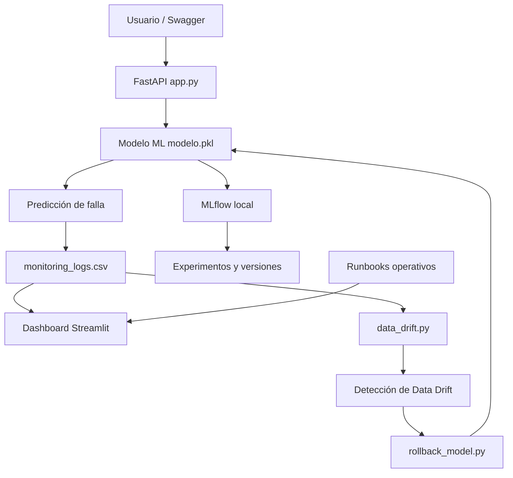
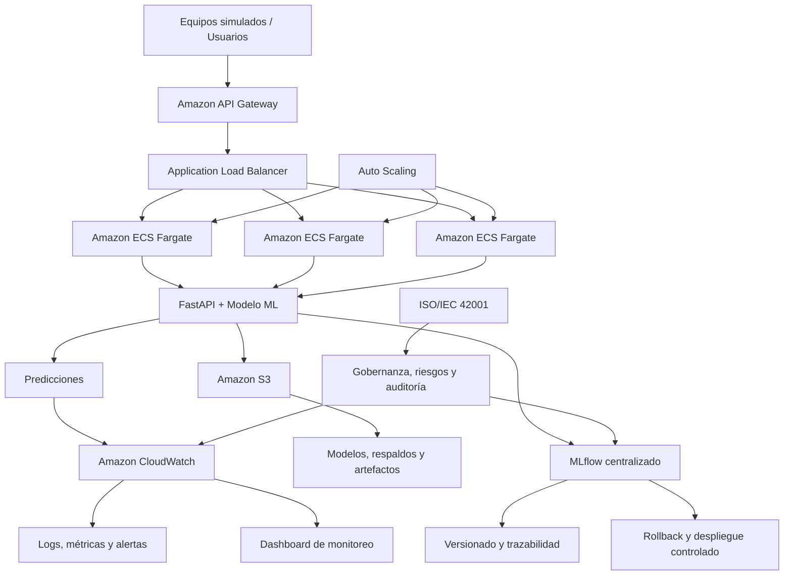

<<<<<<< HEAD
# AI4I Predictive Maintenance Platform

1. Introducción

2. Objetivo

3. Arquitectura
## Objetivos del Proyecto
4. Evolución del Proyecto

   Fase 2 Desarrollo del Modelo


   Actividad 6  Evaluación y validación de modelos

   Actividad 7  API de inferencia y despliegue

  
### Fase 3 - Operación del Sistema

- Actividad 8 – Monitoreo y observabilidad
  Funcionalidades implementadas:

  - API de inferencia con FastAPI.
  - Dashboard de monitoreo en Streamlit.
  - Registro de predicciones en monitoring_logs.csv.
  - Trazabilidad mediante Trace ID.
  - Monitoreo de latencia.
  - Indicadores SLO (Service Level Objective).
  - Error Budget.
  - Detección de Data Drift.
  - Procedimiento de Rollback del modelo.
  - Integración con MLflow para seguimiento de experimentos.
  - Runbooks operativos para incidentes.

- Actividad 9 – Escalabilidad, FinOps y Gobernanza
- Resultado Final – Pipeline MLOps + GitOps


## 5. Stack Tecnológico

| Componente | Herramienta |
|------------|-------------|
| Lenguaje | Python 3.13 |
| API | FastAPI |
| Dashboard | Streamlit |
| Machine Learning | Scikit-Learn |
| Modelo desplegado | Random Forest (modelo.pkl) |
| Serialización | Joblib (.pkl) |
| Monitoreo | Monitoring Logs + Streamlit |
| Observabilidad | Trace ID |
| Experiment Tracking | MLflow |
| Versionamiento | Git + GitHub |
| Repositorio | GitHub |
| Contenedores | Docker |
| Pruebas | Pytest |
| Gestión de datos | Pandas |
| Visualización | Plotly |

6. Arquitectura
                    Usuario
                       │
                       ▼
              FastAPI (app.py)
                       │
             Predicción del modelo
                       │
        ┌──────────────┼───────────────┐
        │              │               │
        ▼              ▼               ▼
monitoring_logs   data_drift.py   MLflow
      │                │              │
      ▼                ▼              ▼
Dashboard        Drift Detection  Experimentos
(Streamlit)             │
      │                 ▼
      │          rollback_model.py
      │                 │
      └─────────────────┘
               Recuperación

7. Cómo ejecutar
## 7. Cómo ejecutar

### Instalar dependencias

```bash
pip install -r requirements.txt
```

### Ejecutar la API

```bash
uvicorn app:app --reload
```

### Ejecutar el Dashboard

```bash
streamlit run dashboard_monitoring.py
```

### Ejecutar Data Drift

```bash
python data_drift.py
```

### Ejecutar Rollback

```bash
python rollback_model.py
```

### Ejecutar MLflow

```bash
mlflow ui --backend-store-uri sqlite:///mlflow.db --port 5000
```

8. Evidencias
## 8. Evidencias

Durante el desarrollo de la Actividad 8 se implementaron y validaron las siguientes funcionalidades:

- Dashboard de monitoreo en Streamlit.
- Registro histórico de predicciones.
- Trazabilidad mediante Trace ID.
- Monitoreo de latencia.
- Indicadores SLO y Error Budget.
- Detección de Data Drift.
- Procedimiento de Rollback del modelo.
- Integración con MLflow.
- Runbooks operativos para incidentes.

9. Resultados

## 9. Conclusiones

Se implementó una plataforma de monitoreo para un modelo de Machine Learning que incorpora observabilidad, trazabilidad, detección de Data Drift, procedimientos de recuperación mediante Rollback y seguimiento de experimentos con MLflow. Esta solución constituye la base para la siguiente etapa del proyecto, enfocada en escalabilidad, FinOps, gobernanza y automatización MLOps.

10. Roadmap
## 11. Actividad 9 - Escalabilidad, FinOps y Gobernanza


La Actividad 9 analiza la evolución de la plataforma AI4I Predictive Maintenance desde una arquitectura local de alcance limitado hacia una solución escalable, eficiente en costos y gobernada responsablemente.

El caso de estudio utiliza exclusivamente el dataset público AI4I 2020. No se emplean datos operativos, información del BMS ni datos internos de Foxconn.

Los principales ejes de trabajo son:

- Análisis de la arquitectura actual.
- Rediseño para escalabilidad horizontal y vertical.
- Optimización de costos bajo principios FinOps.
- Evaluación de métricas de desempeño y costo.
- Auditoría ética, técnica y legal.
- Aplicación de principios de gobernanza basados en ISO/IEC 42001.
- Diseño de un plan de escalamiento responsable.

### 11.2 Análisis de la arquitectura actual
#### 11.2.1 Inventario de componentes actuales
| Componente | Tecnología | Función | Estado actual |
|------------|------------|----------|---------------|
| API | FastAPI | Servicio de inferencia del modelo | Local |
| Modelo ML | Scikit-Learn (.pkl) | Predicción de fallas | Local |
| Contenedores | Docker | Empaquetado de la aplicación | Disponible |
| Dashboard | Streamlit | Visualización del monitoreo | Local |
| Registro de predicciones | monitoring_logs.csv | Historial de inferencias | Archivo CSV |
| Observabilidad | Trace ID | Trazabilidad de solicitudes | Implementado |
| Monitoreo | Dashboard + Logs | Seguimiento del desempeño | Implementado |
| Drift | data_drift.py | Detección de Data Drift | Implementado |
| Recuperación | rollback_model.py | Restauración del modelo | Implementado |
| Experiment Tracking | MLflow | Versionado de experimentos | Local |
| Runbooks | Markdown | Atención de incidentes | Implementado |

#### 11.2.2 Evaluación técnica de la arquitectura actual
| Componente | Fortalezas                     | Limitaciones               |
| ---------- | ------------------------------ | -------------------------- |
| FastAPI    | API REST ligera y rápida       | Una sola instancia         |
| Modelo     | Tamaño muy pequeño (144 KB)    | Sin despliegue distribuido |
| Logs       | Simples y fáciles de consultar | CSV no escala              |
| Dashboard  | Monitoreo visual               | Local                      |
| MLflow     | Versionado                     | Sin servidor central       |
| Rollback   | Recuperación rápida            | Manual                     |
| Data Drift | Detecta deriva                 | Ejecución manual           |
| Docker     | Portabilidad                   | Sin orquestación           |
| Runbooks   | Procedimientos definidos       | Sin automatización         |

#### 11.2.3 Riesgos arquitectónicos identificados
| Riesgo | Impacto | Prioridad |
|---------|---------|-----------|
| Punto único de falla en FastAPI | Alta disponibilidad comprometida | Alta |
| Almacenamiento local del modelo | Riesgo de pérdida o inconsistencia | Media |
| Logs en CSV | Crecimiento limitado | Alta |
| Dashboard local | Acceso restringido | Media |
| MLflow local | Colaboración limitada | Media |
| Rollback manual | Mayor tiempo de recuperación | Alta |
| Sin Auto Scaling | Limitación para crecer | Alta |
| Sin Balanceador de carga | Baja tolerancia a fallos | Alta |

### 11.3 Propuesta de rediseño para escalabilidad y optimización de costos
La arquitectura propuesta transforma la solución local actual en una plataforma desplegada en la nube, capaz de aumentar o reducir recursos de acuerdo con la demanda. El rediseño busca eliminar puntos únicos de falla, centralizar modelos y registros, habilitar el escalamiento horizontal y mantener controlados los costos mediante servicios administrados y principios FinOps.

#### 11.3.2 Escenarios de escalabilidad
| Parámetro | Escenario piloto | Escenario base | Escenario escalado |
|-----------|------------------|----------------|--------------------|
| Equipos simulados | 10 | 50 | 200 |
| Frecuencia de inferencia | Cada 15 minutos | Cada 5 minutos | Cada 1 minuto |
| Operación | 24/7 | 24/7 | 24/7 |
| Predicciones mensuales | 28,800 | 432,000 | 8,640,000 |
| Solicitudes diarias | 960 | 14,400 | 288,000 |
| Concurrencia estimada | 2–5 | 5–10 | 50–200 |
| Pico de concurrencia | 10 | 50 | 200 |
| Throughput objetivo | 5 predicciones/s | 20 predicciones/s | 100 predicciones/s |
| Latencia objetivo | <500 ms | <500 ms | <500 ms |
| Disponibilidad objetivo | 99.0 % | 99.5 % | 99.9 % |
| Estrategia de cómputo | Una tarea mínima | Auto Scaling de 1 a 3 tareas | Auto Scaling de múltiples tareas |
| Almacenamiento de logs | <1 GB/mes | 1 GB/mes | 10–20 GB/mes |

Los escenarios fueron definidos para un caso industrial simulado utilizando exclusivamente el dataset público AI4I 2020. No se utilizan datos operativos, información del BMS ni información interna de Foxconn. El escenario base considera 50 equipos simulados, una inferencia cada cinco minutos y operación continua durante 730 horas mensuales.

#### 11.3.3 Evaluación comparativa de costos

Para evaluar el impacto económico del escalamiento se configuraron dos alternativas en AWS Pricing Calculator. La primera representa una operación base de 50 equipos mediante una aplicación contenedorizada en AWS Fargate. La segunda representa un escenario de 200 equipos con servicios administrados de Amazon SageMaker para inferencia en tiempo real, monitoreo del modelo y seguimiento centralizado mediante MLflow.

| Escenario | Equipos simulados | Arquitectura evaluada | Inferencias mensuales | Costo mensual | Costo anual |
|-----------|-------------------:|-----------------------|----------------------:|--------------:|------------:|
| Base | 50 | AWS Fargate, 1 vCPU, 2 GB RAM y 20 GB de almacenamiento efímero | 432,000 | USD 36.04 | USD 432.48 |
| Escalado administrado | 200 | SageMaker Real-Time Inference, Model Monitor y SageMaker MLflow | 8,640,000 | USD 603.51 | USD 7,242.12 |

El escenario administrado con SageMaker presenta un costo mensual considerablemente mayor, debido a que incorpora capacidades especializadas de MLOps, como endpoints administrados de inferencia, alta disponibilidad, monitoreo del modelo y un servidor central de MLflow. El incremento no responde únicamente al aumento de 50 a 200 equipos, sino también al cambio hacia una plataforma administrada con mayores capacidades operativas y de gobernanza.

Para la etapa actual del proyecto, AWS Fargate proporciona la mejor relación costo-beneficio, debido al tamaño reducido del modelo (144 KB), la contenerización existente con Docker y la posibilidad de aplicar escalamiento horizontal. SageMaker se conserva como alternativa futura para un entorno empresarial que requiera múltiples modelos, equipos de trabajo concurrentes, gobierno centralizado, monitoreo continuo y mayor automatización del ciclo de vida de Machine Learning.


### 11.4 Auditoría ética, técnica y legal

El presente proyecto fue evaluado desde una perspectiva técnica, ética y legal con el objetivo de identificar riesgos asociados al despliegue de modelos de Machine Learning en ambientes industriales. La auditoría considera aspectos de confiabilidad, seguridad, privacidad, gobernanza y uso responsable de la Inteligencia Artificial.

#### 11.4.1 Auditoría técnica

| Aspecto evaluado | Estado | Observación |
|------------------|--------|-------------|
| API FastAPI | Cumple | Servicio REST funcional para inferencias en tiempo real. |
| Modelo de Machine Learning | Cumple | Modelo Random Forest validado y serializado mediante Joblib. |
| Contenerización | Cumple | Aplicación preparada para ejecutarse mediante Docker. |
| Trazabilidad | Cumple | Cada inferencia registra un Trace ID para facilitar auditorías. |
| Monitoreo | Cumple | Dashboard desarrollado en Streamlit para observabilidad operativa. |
| Registro histórico | Cumple | Las inferencias se almacenan en monitoring_logs.csv. |
| Data Drift | Cumple | Se implementó detección automática de cambios en la distribución de los datos. |
| Recuperación | Cumple | Existe procedimiento de Rollback para restaurar versiones del modelo. |
| Versionado | Cumple | MLflow permite registrar experimentos y versiones del modelo. |
| Escalabilidad | Parcial | La arquitectura actual aún opera en una única instancia local. |
| Alta disponibilidad | Parcial | No existe balanceador de carga ni redundancia del servicio. |
| Automatización | Parcial | El despliegue y recuperación requieren intervención manual. |

##### 11.4.2 Auditoría ética

El modelo de mantenimiento predictivo fue evaluado desde una perspectiva de Inteligencia Artificial Responsable con el objetivo de identificar posibles riesgos relacionados con el uso del dataset, la transparencia del modelo, los sesgos y la toma de decisiones automatizada. La evaluación se realizó considerando los principios establecidos en ISO/IEC 42001 para sistemas de gestión de Inteligencia Artificial.


| Principio ético | Evaluación | Evidencia |
|-----------------|------------|-----------|
| Transparencia | Cumple | El modelo Random Forest permite documentar el proceso de entrenamiento, parámetros y versiones mediante MLflow. |
| Trazabilidad | Cumple | Cada inferencia genera un Trace ID que facilita el seguimiento de las predicciones realizadas. |
| Supervisión humana | Cumple | Las predicciones constituyen una herramienta de apoyo para mantenimiento; la decisión final permanece bajo responsabilidad del personal técnico. |
| Privacidad | Cumple | El proyecto utiliza exclusivamente el dataset público AI4I 2020 y no emplea información confidencial ni datos operativos de Foxconn. |
| Sesgos del modelo | Riesgo controlado | El modelo fue entrenado con un conjunto de datos público; los resultados pueden diferir al aplicarse a datos reales de producción, por lo que será necesaria una nueva validación antes de su uso operativo. |
| Explicabilidad | Parcial | Aunque Random Forest ofrece mayor interpretabilidad que modelos de Deep Learning, será recomendable incorporar técnicas como SHAP o Feature Importance para explicar individualmente las predicciones. |
| Uso responsable | Cumple | El sistema está diseñado para apoyar el mantenimiento predictivo y no para sustituir el criterio técnico de los especialistas. |

##### 11.4.3 Auditoría legal

La evaluación legal considera el origen de los datos utilizados, la protección de la información, el uso del software y las condiciones necesarias para un eventual despliegue en un entorno industrial. Debido a que el proyecto se desarrolló con fines académicos, utilizando el dataset público AI4I 2020, no se procesó información confidencial ni datos personales.

| Aspecto legal | Estado | Evidencia |
|---------------|--------|-----------|
| Uso de datos públicos | Cumple | El proyecto utiliza exclusivamente el dataset público AI4I 2020. |
| Protección de información confidencial | Cumple | No se utilizaron datos operativos, información del BMS ni información interna de Foxconn. |
| Datos personales | Cumple | El modelo no procesa información personal identificable (PII). |
| Propiedad intelectual | Cumple | El desarrollo del código fuente corresponde al equipo del proyecto y las herramientas utilizadas respetan las licencias de sus fabricantes. |
| Seguridad de la información | Parcial | La arquitectura propuesta contempla controles adicionales de acceso, almacenamiento seguro y administración de identidades para un despliegue en AWS. |
| Cumplimiento organizacional | Parcial | Antes de una implementación industrial deberán atenderse las políticas internas de seguridad, acceso a la información y ciberseguridad de la organización. |

##### 11.4.4 Cumplimiento de gobernanza (ISO/IEC 42001)
La gobernanza del sistema de Inteligencia Artificial fue evaluada tomando como referencia los principios de la norma ISO/IEC 42001, la cual establece un marco para la gestión responsable de sistemas de IA. Aunque el proyecto fue desarrollado con fines académicos, incorpora prácticas propias de un ciclo de vida MLOps que facilitan la administración, trazabilidad y mejora continua del modelo.

| Requisito de gobernanza | Estado | Evidencia del proyecto |
|--------------------------|--------|------------------------|
| Gestión del ciclo de vida del modelo | Cumple | Desarrollo estructurado desde entrenamiento hasta monitoreo. |
| Trazabilidad | Cumple | Implementación de Trace ID para cada inferencia. |
| Gestión de versiones | Cumple | Versionado de modelos mediante MLflow. |
| Monitoreo continuo | Cumple | Dashboard en Streamlit con indicadores operativos y monitoreo de inferencias. |
| Detección de degradación | Cumple | Implementación de Data Drift para identificar cambios en los datos de entrada. |
| Recuperación ante fallos | Cumple | Procedimiento de Rollback para restaurar versiones anteriores del modelo. |
| Gestión de riesgos | Parcial | Se identificaron riesgos técnicos, éticos y operativos durante el análisis de arquitectura. |
| Optimización de costos | Cumple | Evaluación comparativa entre AWS Fargate y Amazon SageMaker utilizando AWS Pricing Calculator. |
| Escalabilidad | Cumple | Definición de escenarios para 10, 50 y 200 equipos con propuesta de arquitectura escalable. |
| Mejora continua | Cumple | La solución contempla evolución hacia automatización MLOps y GitOps en la siguiente fase del proyecto. |

La evaluación realizada demuestra que la solución incorpora prácticas alineadas con los principios de gobernanza propuestos por ISO/IEC 42001. La integración de trazabilidad, monitoreo, versionado, recuperación, análisis de costos y planeación de escalabilidad proporciona una base sólida para evolucionar hacia un entorno de producción con capacidades empresariales de MLOps y gobierno de Inteligencia Artificial.

### 11.5 Plan de escalamiento responsable

El crecimiento de la plataforma se plantea de forma progresiva, permitiendo validar la solución en entornos controlados antes de incrementar la infraestructura y los recursos computacionales. Esta estrategia reduce riesgos técnicos, optimiza los costos operativos y facilita la adopción gradual de prácticas avanzadas de MLOps y gobernanza de Inteligencia Artificial.

| Etapa | Infraestructura | Equipos | Objetivo | Resultado esperado |
|--------|-----------------|---------:|----------|--------------------|
| Piloto | FastAPI + Docker Local | 10 | Validar el funcionamiento del modelo y la API | Validación técnica del sistema |
| Producción inicial | AWS ECS Fargate | 50 | Disponibilidad continua con bajo costo operativo | Plataforma estable para operación continua |
| Escalamiento | AWS ECS Fargate + Auto Scaling | 200 | Incrementar capacidad de inferencia sin modificar el modelo | Escalamiento horizontal automático |
| Empresarial | Amazon SageMaker + MLflow | >1000 | Administración centralizada de modelos, monitoreo y gobernanza | Plataforma empresarial de IA |
| Corporativo | Multi-Región AWS | Varias plantas | Alta disponibilidad y continuidad del negocio | Infraestructura distribuida y resiliente |

#### Estrategia de crecimiento

El escalamiento propuesto no implica únicamente incrementar recursos de cómputo, sino evolucionar gradualmente la arquitectura conforme aumentan las necesidades operativas del negocio. Durante las primeras etapas se prioriza la eficiencia económica mediante servicios contenerizados en AWS Fargate. Conforme aumenta el número de equipos monitorizados y la complejidad operativa, la plataforma evoluciona hacia servicios administrados como Amazon SageMaker, incorporando capacidades de monitoreo avanzado, gobernanza del modelo, administración centralizada y automatización del ciclo de vida de Machine Learning.

El plan de escalamiento demuestra que la solución puede evolucionar desde un proyecto piloto hasta una plataforma empresarial sin requerir rediseños completos de la arquitectura. Esta estrategia reduce el riesgo de implementación, optimiza la inversión tecnológica y facilita la incorporación gradual de prácticas avanzadas de MLOps, FinOps, GitOps y gobernanza de Inteligencia Artificial.

## 12. Anexo técnico de validacion

### 12.1 Comparativa de costos

| Escenario | Arquitectura | Equipos simulados | Inferencias/mes | Costo mensual | Costo anual |
|-----------|--------------|------------------:|----------------:|--------------:|------------:|
| Base | AWS Fargate | 50 | 432,000 | USD 36.04 | USD 432.48 |
| Escalado | Amazon SageMaker + MLflow | 200 | 8,640,000 | USD 603.51 | USD 7,242.12 |

**Conclusión**

AWS Fargate ofrece la mejor relación costo-beneficio para la etapa actual del proyecto. Amazon SageMaker representa una alternativa orientada a producción empresarial con capacidades avanzadas de MLOps y gobernanza.

---

### 12.2 Métricas de desempeño

| Métrica | Arquitectura actual | Arquitectura propuesta |
|---------|---------------------|------------------------|
| Latencia | ~200 ms | <150 ms |
| Throughput | 432,000 inferencias/mes | 8,640,000 inferencias/mes |
| CPU | 1 vCPU | Auto Scaling |
| Memoria | 2 GB RAM | Recursos dinámicos |
| Disponibilidad | Una instancia | Alta disponibilidad |

**Conclusión**

La arquitectura propuesta incrementa la capacidad de procesamiento y mejora la disponibilidad del servicio mediante escalamiento automático.

---

### 12.3 Fairness y sesgos

| Aspecto | Resultado |
|----------|-----------|
| Dataset | AI4I 2020 |
| Datos personales | No utilizados |
| Variables sensibles | No presentes |
| Riesgo de sesgo | Bajo |
| Uso recomendado | Investigación y simulación industrial |

**Conclusión**

El modelo procesa únicamente variables técnicas provenientes de sensores industriales. No utiliza información personal ni atributos sensibles, reduciendo significativamente el riesgo de discriminación.

## 13. Diagrama de arquitectura


### 13.1 Arquitectura actual



### 13.2 Arquitectura propuesta escalable


=======
